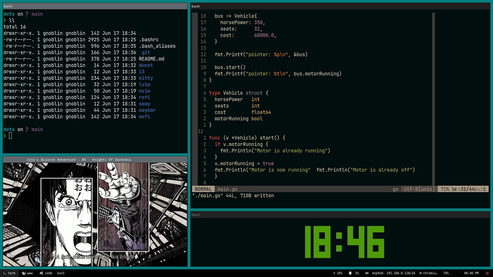

# Dots

## Example



## Bash

```bash
curl -sS https://starship.rs/install.sh | sh
sudo dnf install bash-completion
```

## Nvim

```bash
curl -LO https://github.com/neovim/neovim/releases/latest/download/nvim.appimage
chmod u+x nvim.appimage
./nvim.appimage
```

## LunarVim

```bash
bash <(curl -s https://raw.githubusercontent.com/lunarvim/lunarvim/master/utils/installer/install.sh)
```

